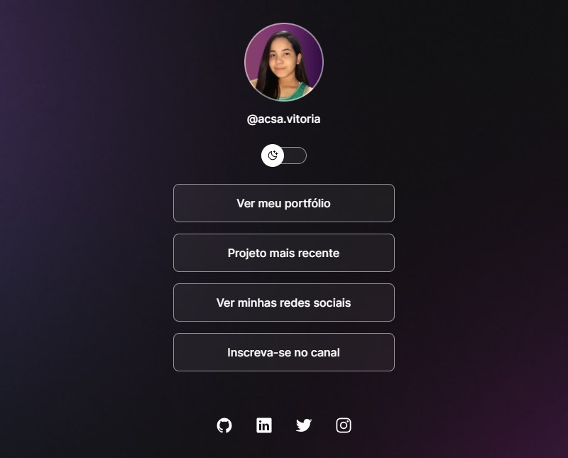

<h1 align="center">DevLink</h1>

Projeto realizado com o curso discover da plataforma Rocketseat

  

##✅ Tecnologias

Esse projeto foi desenvolvido com as seguintes tecnologias:
- HTML
- CSS
- JavaScript
- Figma

##💻 Projeto

O projeto é uma página que mostra os links do desenvolvedor, seu portfólio, seu projeto mais recente, suas redes sociais e etc. E com um botão de modo dark e light.